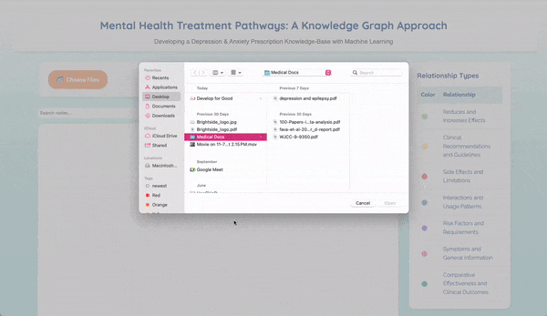
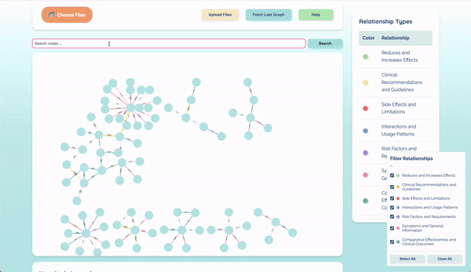

# Knowledge Graph For Mental Health Treatment Decision Support

This repository contains tools and methodologies for evaluating Knowledge Graphs (KGs) generated by Large Language Models (LLMs) against manually annotated ground truth data. It also includes a user interface (UI) for managing KG data, as well as prompt engineering and evaluation techniques.

#### Authored by **Rishika Srinivas** (@rishikasrinivas), **Nataliia Kulieshova** (@Kulieshova), **Anushka Limaye** (@anushkalimaye), **Kymari Bratton** (@Kymari28), **Fernanda Del Toro** (@Fernandadeltoro)
---

## Ground Truth Annotation  

Hand annotations were meticulously developed by team members, who manually reviewed every sentence across three provided PDFs. These annotations formed triplets structured as:  
- `subj` (Subject)  
- `relationship` (Relationship)  
- `obj` (Object)  

---

## User Interface (UI)  

### Features  
1. **Uploading Files:**
   
   Users can upload PDF or CSV files for processing into KG format.  

3. **Fetching Previous KGs:**  
   Retrieve previously saved Knowledge Graphs for continued analysis.  

4. **Searching the KG:**
   

   Perform searches on the KG to find specific triplets or related entities.  

6. **Reading the KG:**
   VISUALS TBA

    Visualize the KG with clear distinctions using color coding and edge weights.  

### Visualization Features  
- **Color Coding:**
     VISUALS TBA

   Visual cues for different entity types and relationships.  
- **Edge Weights:**
     VISUALS TBA
   Representing the strength of relationships.  

---

## Evaluation Methods  

### Evaluation Metrics Table  

| **Method**               | **Type**       | **Accuracy/Result** | **Key Pitfalls**                   |  
|---------------------------|----------------|--------------|-------------------------------------|  
| Fuzzy Wuzzy              | Statistical    | 35.32%       | Low accuracy, only simple matches. |  
| TF-IDF + Cosine Similarity | Statistical    | 36.28%       | Limited to vectorized text formats.|  
| GPT Critic               | Model-Based    | 61.66%       | Requires large computational resources.|  
| G-Eval                   | Model-Based    | TBD          | Requires large computational resources.    |  
| PyTorch + bioBERT        | Model-Based    | TBD          | TBD    |  
| Precision                | Statistical    | 81.81          | Applies cosine similarity which is not always a good indication of contextual similarity    |  

---

### Detailed Evaluation Methodologies  

#### 1. **Fuzzy Wuzzy**  
- **Evaluation Type:** Statistical  
- **Method:**  
   - Compare each row of the ground truth to each row of LLM output.  
   - Threshold for “matching” requires 70% or above similarity.  
- **Accuracy:** 35.32%  
- **Output:**  
   - Rows of LLM output that match the ground truth at or above 70% similarity.  
   - Only one triplet pair is found matching per threshold.  

---

#### 2. **TF-IDF Vector and Cosine Method**  
- **Evaluation Type:** Statistical, Feature-weighting  
- **Method:**  
   - Combine the triplet columns into a single string.  
   - Vectorize text using TF-IDF to convert it to numeric form.  
   - Compare each LLM row to each ground truth row using cosine similarity.  
- **Accuracy:** 36.28%  
- **Output:** Best matching ground truth row for each LLM output row.  

---

#### 3. **GPT Critic Parallel Batch Request**  
- **Evaluation Type:** Model-Based  
- **Method:**  
   - Uses 10 worker threads to enable parallel comparisons.  
   - Compares each LLM output row with ground truth rows using GPT-4 (RLHF).  
   - Finds the best similarity score for each LLM output.  
- **Accuracy:** 61.66%  
- **Output:** Best ground truth match for each LLM output row.  

---

#### 4. **G-Eval**  
- **Evaluation Type:** Model-Based  
- **Method:**
   - Compare each row of the ground truth to each row of the LLM output.
   - Calculate semantic similarity between two triples considering medical domain knowledge.
- **Threshold for Matching:** 0.7, 0.5 
- **Accuracy:** 46% 
- **Output:** Display the percentage of “matches” between ground truth and actual input. 

---

#### 6. **Precision** 
- **Evaluation Type:** Statistical: word match and cosine similarity 
- **Method:** Checking if the extracted relationship is in the source text or in the ground truth annotations  
- **Threshold for Matching:** 0.7 
- **Precision Score:** 81.82

#### 7. **Hallucination** 
- **Evaluation Type:** TBA
- **Method:** TBA
- **Threshold for Matching:** TBA 
- **Hallucination Score:** TBA

---

## Contribution  
We welcome contributions to improve the evaluation methods, refine the UI, or expand the dataset. Please feel free to submit issues or pull requests.  

