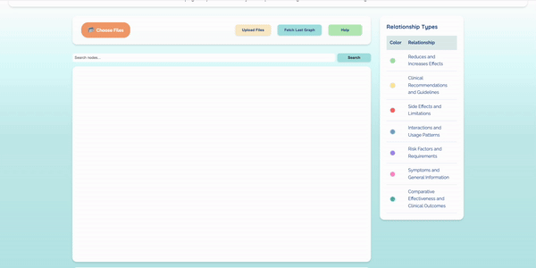
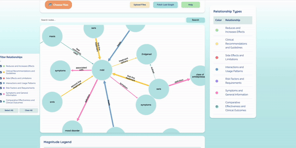
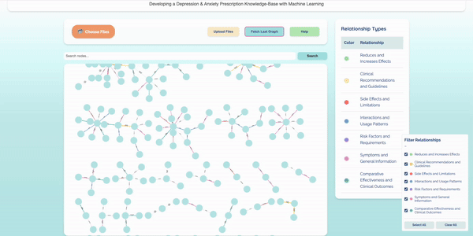

  

  <h3 style="font-weight: 600; font-size: 20px; max-width: 800px;">
    This repository contains tools and methodologies for evaluating Knowledge Graphs (KGs) generated by Large Language Models (LLMs) against manually annotated ground truth data. It also includes a user interface (UI) for managing KG data, as well as prompt engineering and evaluation techniques.
  </h3>

## 👥 Our Team 

  <table>
    <tr>
      <td align="center">
        
      </td>
      <td align="center">
        
      </td>
      <td align="center">
        
      </td>
      <td align="center">
        
      </td>
      <td align="center">
        
      </td>
    </tr>
    <tr>
      <td align="center"><strong>Rishika Srinivas</strong>   @rishikasrinivas</td>
      <td align="center"><strong>Nataliia Kulieshova</strong>   @Kulieshova</td>
      <td align="center"><strong>Anushka Limaye</strong>   @anushkalimaye</td>
      <td align="center"><strong>Kymari Bratton</strong>   @Kymari28</td>
      <td align="center"><strong>Fernanda Del Toro</strong>   @Fernandadeltoro</td>
    </tr>
  </table>

## 🛠️ Technologies Used

### Core Technologies
- **Languages:** Python, HTML, CSS, JavaScript  
- **Database:** MongoDB  
- **AI Integration:** OpenAI API
- **User Interface:** React with Cytoscape.js for graph visualization

## 📝 Ground Truth Annotation  

Hand annotations were meticulously developed by team members, who manually reviewed every sentence across three provided PDFs. These annotations formed triplets structured as:  
- `subj` (Subject)  
- `rel` (Relationship)  
- `obj` (Object)  

## 💫 User Interface (UI)
  #### 1. Upload Files 📤
  

    
  

  
  Easily import PDFs, which are converted into Knowledge Graphs (KGs) that extract clinical entities and relationships.
  
  #### 2. Fetch Previous Graphs 🔄
  

    
  

  
  Retrieve saved Knowledge Graphs for continued analysis or updates.
  
  #### 3. Search and Highlight 🔍
  

    
  

  
  A search-first design lets users quickly locate nodes or relationships. Results are highlighted in orange and zoomed in for clarity.
  
  #### 4. Dynamic Visualization 📊
  

    
  

  
  Nodes represent clinical entities, and edges use color coding and varying thickness to show relationship categories and strength.
  The Relationship Table offers a legend with clickable colored circles for more details on each relationship.
  A magnitude table shows the significance of relationships.
  #### 5. Custom Filtering 🎯
  

    
  

  
  Users can filter the graph to focus on specific relationship types (e.g., "Side Effects" or "Recommendations"), improving clarity without clutter.
  
  #### 6. Help Button ℹ️
  

    
  

  
  An intuitive Help button offers guidance on the graph's features, ensuring accessibility for new users and clinicians unfamiliar with knowledge graphs.

### Design Highlights ✨

- **Brightside Health Branding**: The design aligns with **Brightside Health's brand** using calming blues, pastels, and creative accents like **color-coded edges** for a clean, engaging experience.
- **User-Centered Design**: Focuses on usability with:
  - **Interactive Relationship Table** for easy data interpretation
  - **Edge Thickness** to prioritize strong relationships for evidence-based decisions
  - **Search and Filtering** for focused, efficient navigation

## 📊 Evaluation Methods

### Evaluation Metrics Table 

| **Method**               | **Type**       | **Accuracy** | **Key Pitfalls**                   |
|---------------------------|----------------|--------------|-------------------------------------|
| Accuracy (GPT Critic)               | Model-Based    | 86.0%       | Utilizes an LLM to evaluate an LLM.|
| Precision                | Statistical  | 81.81%        | Can be mislead by cosine similarity|
| Hallucination            | Model-Based   |   33.80%            | Utilizes an LLM to evaluate an LLM.|

### Detailed Evaluation Methodologies

### Final Metrics:

#### 1. **Accuracy**  
- **Framework used**: GPT Critic
- **Evaluation Type:** Model-Based  
- **Method:**  
   - Uses 10 worker threads to enable parallel comparisons.  
   - Compares each LLM output row with ground truth rows using GPT-3.5-turbo.  
   - Finds the best similarity score for each LLM output.  
- **Accuracy:** 86.0%  
- **Output:** Best ground truth match for each LLM output row.

#### 2. **Precision** 
- **Evaluation Type:** Statistical: word match and cosine similarity 
- **Method:** Checking if the extracted relationship is in the source text or in the ground truth annotations  
- **Threshold for Matching:** 0.7
- **Precision Score:** 81.81%

#### 3. **Hallucination** 
- **Evaluation Type:** Statistical: Factual Alignment and Consistency
- **Method:** DeepEval Hallucination Metric
- **Threshold for Matching:** 0.5
- **Hallucination Score:** 33.80%

---
### Explored Metrics for Accuracy:
| **Method**               | **Type**       | **Accuracy** | **Key Pitfalls**                   |
|---------------------------|----------------|--------------|-------------------------------------|
| Fuzzy Wuzzy              | Statistical    | 35.32%       | Low accuracy, only simple matches. |
| TF-IDF + Cosine Similarity | Statistical  | 36.28%       | Limited to vectorized text formats.|
| GPT Critic               | Model-Based    | 86.0%       | Utilizes an LLM to evaluate an LLM.|
| RAGA                     | Model-Based    | 69.67%      | Utilizes an LLM to evaluate an LLM.|
| G-Eval                   | Model-Based    | 46.6%        | Recommended use of medical domain dictionary.  |

#### 1. **Fuzzy Wuzzy**  
- **Evaluation Type:** Statistical  
- **Method:**  
   - Compare each row of the ground truth to each row of LLM output.  
   - Threshold for “matching” requires 70% or above similarity.  
- **Accuracy:** 35.32%  
- **Output:**  
   - Rows of LLM output that match the ground truth at or above 70% similarity.  
   - Only one triplet pair is found matching per threshold.  

#### 2. **TF-IDF Vector and Cosine Method**  
- **Evaluation Type:** Statistical, Feature-weighting  
- **Method:**  
   - Combine the triplet columns into a single string.  
   - Vectorize text using TF-IDF to convert it to numeric form.  
   - Compare each LLM row to each ground truth row using cosine similarity.  
- **Accuracy:** 36.28%  
- **Output:** Best matching ground truth row for each LLM output row.

  
#### 4. **GPT Critic**  
- **Evaluation Type:** Model-Based  
- **Method:**  
   - Uses 10 worker threads to enable parallel comparisons.  
   - Compares each LLM output row with ground truth rows using GPT-3.5-turbo.  
   - Finds the best similarity score for each LLM output.  
- **Accuracy:** 86.0%  
- **Output:** Best ground truth match for each LLM output row.

  
#### 4. **RAGA**  
- **Evaluation Type:** Model-Based  
- **Method:**  
   - Uses 10 worker threads to enable parallel comparisons.  
   - Compares each LLM output row with ground truth rows using GPT-3.5-turbo.  
   - Finds the best similarity score for each LLM output based on 3 criteria (Retrieval, Augmentation, and Generation).  
- **Accuracy:** 69.67%
    -  Retrieval: 61.0%
    -  Augmentation: 73.0%
    -  Generation: 75.0%
- **Output:** Best ground truth match for each LLM output row.  

#### 5. **G-Eval**  
- **Evaluation Type:** Model-Based  
- **Method:**
    - Define common synonyms and related terms in the medical domain
    - Calculate semantic similarity between two triples considering medical domain knowledge.
    - Evaluate matches between ground truth and LLM output
- **Accuracy:** 46.60%
- **Output:** Shows ground truth row with actual output row along with best evaluation score ranging from 0.10 to 0.80.

---

## ✨ Contribution  
We welcome contributions to improve the evaluation methods, refine the UI, or expand the dataset. Please feel free to submit issues or pull requests.  

---

## ⚖️ License  
This project is licensed under the [MIT License](LICENSE).  
